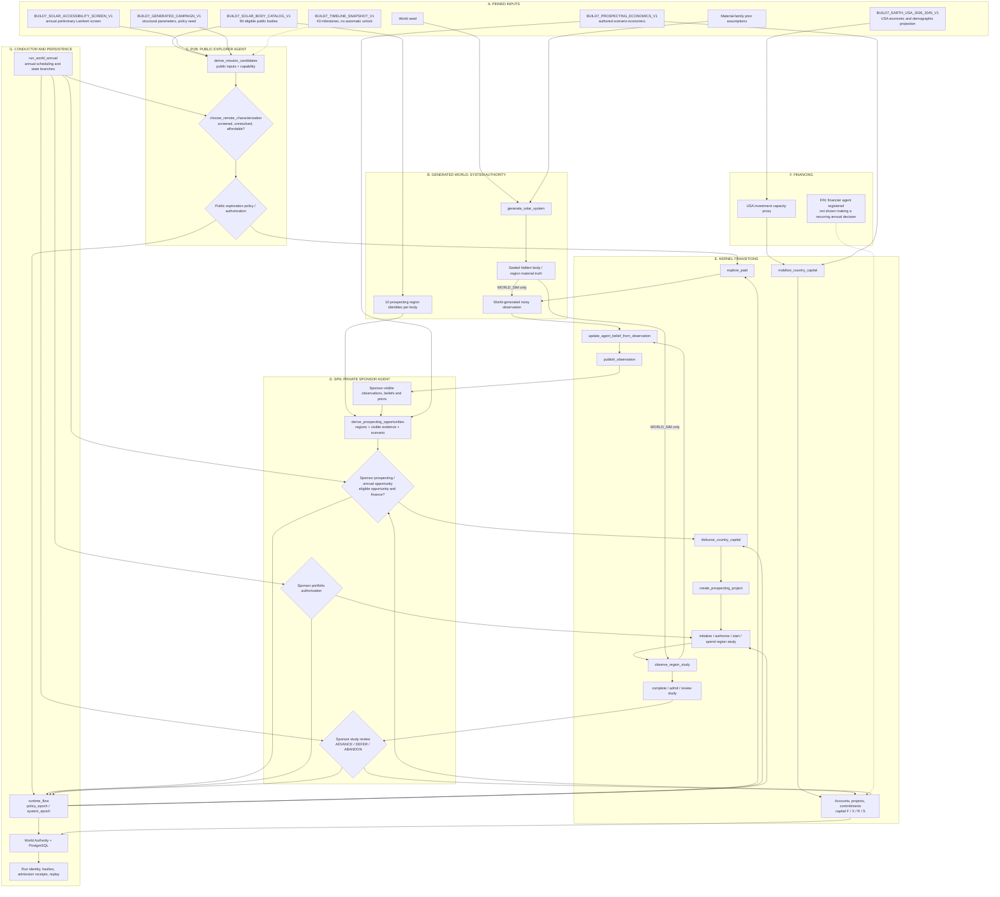
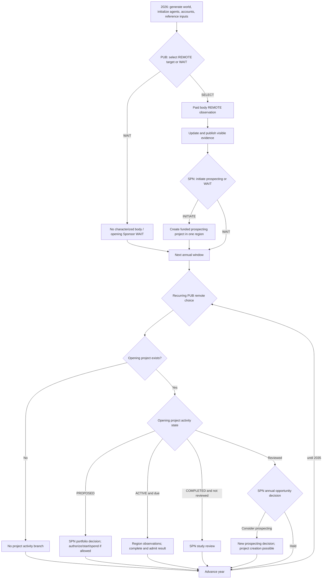

# Build 7 generated-world semantic causal baseline v0.1

**Status:** SOURCE-DERIVED DRAFT / NON-QUALIFICATION. **Scope:** Generated-world first-run and annual 2026–2035 campaign, not the targeted Build 7 path. **Purpose:** Map sources, agents, policies, hidden truth, transitions, and persistence *before* performance assessment or redesign.

The diagrams show causal dependencies, not always direct calls. Dashed lines mark a registered capability or a qualified relationship rather than an established decision in the annual path.

## 1. As-built semantic causal map

**Semantics:** PUB, SPN, FIN are agent identities. The annual conductor, World Authority, generators, policy workers and kernel transitions are **systems**, not additional agents. Policies select or authorize; kernel transitions execute consequences. Hidden truth is not directly available to agents. The timeline is read-only context and cannot automatically unlock technology. The financing agent is registered in the generated kernel, but the inspected annual path does not establish a recurring independent FIN underwriting decision.

## 2. Annual decision and consequence sequence

The recurring Sponsor conductor retains an opening `project_id` and follows its activity lifecycle. Additional project records do **not** establish an independent multi-project annual scheduler. A conductor fallback `NO_ACTION` must not be interpreted as a deliberate agent WAIT without a corresponding policy decision.

## 3. Input and model-semantics register

| Source or rule | Meaning in generated-world Build 7 | Status / abstraction |
|---|---|---|
| `inputs/BUILD7_GENERATED_CAMPAIGN_V1.json` | Structural parameters, recovery capability, policy seed | Authored, fixed 2026 capability; not empirically calibrated |
| `inputs/BUILD7_EARTH_USA_2026_2045_V1.json` | USA investment and population/economic series | Promoted model projection; investment is a capacity proxy, not spendable cash |
| `inputs/BUILD7_TIMELINE_SNAPSHOT_V1.json` | 43 reference milestones | Read-only; no date-based automatic unlock |
| `inputs/BUILD7_SOLAR_BODY_CATALOG_V1.json` | 90 eligible public body identities | Public catalog; no hidden deposits exposed |
| `inputs/BUILD7_SOLAR_ACCESSIBILITY_SCREEN_V1.json` | Annual Earth-to-body `SCREENED` / `UNKNOWN` and comparison burden | Sampled zero-revolution, Sun-centered Lambert screening, **not** Jupiter gravity-assist optimization or mission qualification |
| Material-family generation assumptions | Hidden resource presence across body and region | Fictional prior/realization abstraction |
| `inputs/BUILD7_PROSPECTING_ECONOMICS_V1.json` | Prospecting capital, information value, mobilization assumptions | Authored coarse economics, not resource-reserve valuation |
| World seed | Reproducible generated hidden truth | Hidden-world realization |
| Policy seed | Deterministic tie-breaks between eligible alternatives | Replay mechanism, not economic utility |
| `runtime_flow.py` | Policy input admission, policy/system epochs, causal records | System orchestration and provenance |
| World Authority / PostgreSQL | Persistent world, observation, economic and decision state | Source of persisted consequences |

**Important decision detail:** `exploration_choice.choose_remote_characterization` filters on `SCREENED`, capability, unresolved status and affordability, then uses a SHA-256 tie-break among eligible bodies. It does **not** rank candidates by the numerical transfer burden. The Sponsor annual opportunity policy similarly applies commercial/belief/financing eligibility before deterministic tie-breaking. A Jupiter gravity-assist window is therefore **not** an established cause of the 2030 ʻOumuamua selection.

## 4. Intentional abstractions and recorded repairs

- **Accessibility:** added a common comparable mission surface where public authority lacked one; preliminary Lambert screen is not a flight plan.
- **Remote sensing:** a shared four-material-family characterization with authored detection 0.80 and false-positive 0.20; corrected earlier water-only narrowing.
- **Body-scoped REMOTE observations:** repaired an earlier location-binding limitation so remote observation does not require a fictional surface site.
- **Prospecting regions:** ten deterministic region identities per body; region-specific physical inference is not automatically established by body-level signals.
- **Earth-to-Offworld capital:** explicit conversion of country-level investment capacity into model-currency financing; not a claim that Earth investment is cash in an actor account.
- **Annual continuation:** later-year PUB exploration and Sponsor opportunity policies repaired an earlier causal break where `NO_ACTION` was merely a conductor fallback. Existing opening-project lifecycle still constrains subsequent Sponsor scheduling.
- **Deterministic tie-breaks:** deliberate coarse behavior in place of detailed scientific utility and sponsor investment optimization.

These are source-defined abstractions and documented repairs, not a mandate to add more machinery.

## 5. ABM baseline evaluation, without performance conclusions

| Principle | Source-grounded assessment |
|---|---|
| Agents versus environment | Explicit PUB/SPN/FIN identities, separate policies and system transitions |
| Agent information boundaries | Separate visible observations/beliefs and sealed hidden truth |
| Scheduling | Explicit annual conductor; scheduling affects which policies can act |
| Adaptation | Belief updates exist; candidate ranking remains deliberately coarse |
| Heterogeneity | Distinct agent roles; limited preference differentiation in examined generated-world decisions |
| Feedback and consequences | Project finance, activities, study outcomes and persistent state are represented |
| Reproducibility | Run identity, seeds, source hashes, epochs and replay machinery |
| Scientific validity | Several assumptions explicitly structural/not calibrated; do not read them as predictions |
| Runtime performance | **Not assessed in this document** |

## 6. Traceability and exclusions

Code paths reviewed:
- [`generated_campaign.py`](generated_campaign.py): `_build_kernel`, `start_world_run`, `derive_world_prospecting_opportunities`, `run_world_prospecting_initiation`, `run_world_annual`
- [`opportunities.py`](opportunities.py): `derive_mission_candidates`
- [`exploration_choice.py`](exploration_choice.py): `choose_remote_characterization`
- [`runtime_flow.py`](runtime_flow.py): `policy_epoch`, `system_epoch`
- [`compile_solar_accessibility.py`](compile_solar_accessibility.py): dated Lambert comparison screen
- [`BUILD7_INCREMENT_1_3_REPAIR_RECORD.md`](BUILD7_INCREMENT_1_3_REPAIR_RECORD.md): historical repair and abstraction decisions
- [`BUILD7_INCREMENT6_QUALIFICATION_RECORD.md`](BUILD7_INCREMENT6_QUALIFICATION_RECORD.md): observed campaign and recurring-decision repairs

**Excluded:** profiler findings, proposed optimizations, unimplemented market behavior, and any claim that generated-world Build 7 already simulates extraction, settlement, migration or trade.

**Baseline stopping rule:** Before treating this map as frozen, verify every substantive arrow against exact policy worker and transition implementation. Do not infer that a registered capability was exercised in the generated-world annual campaign.
