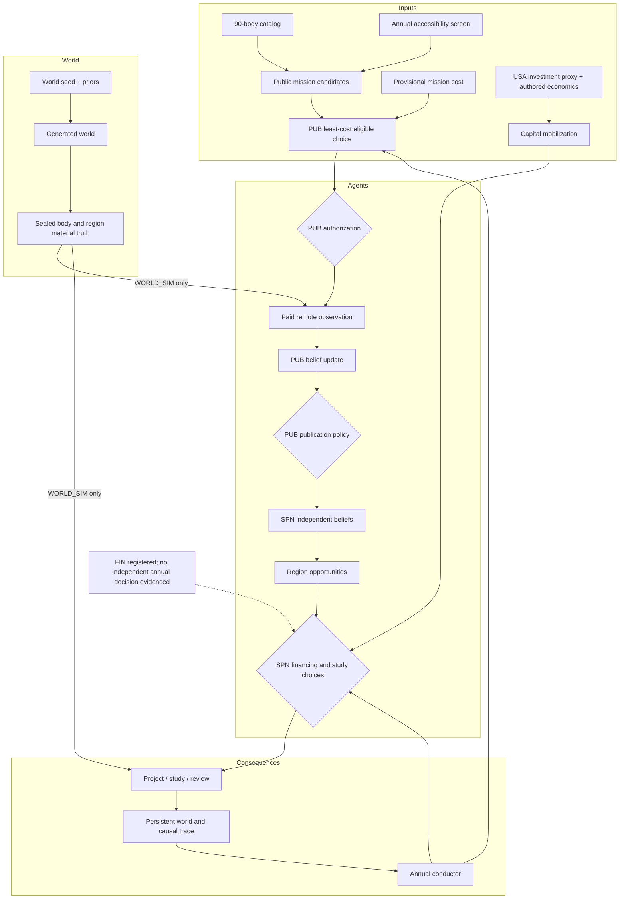
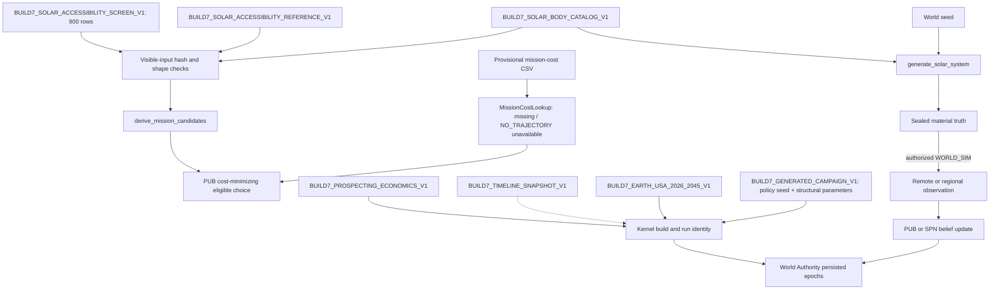
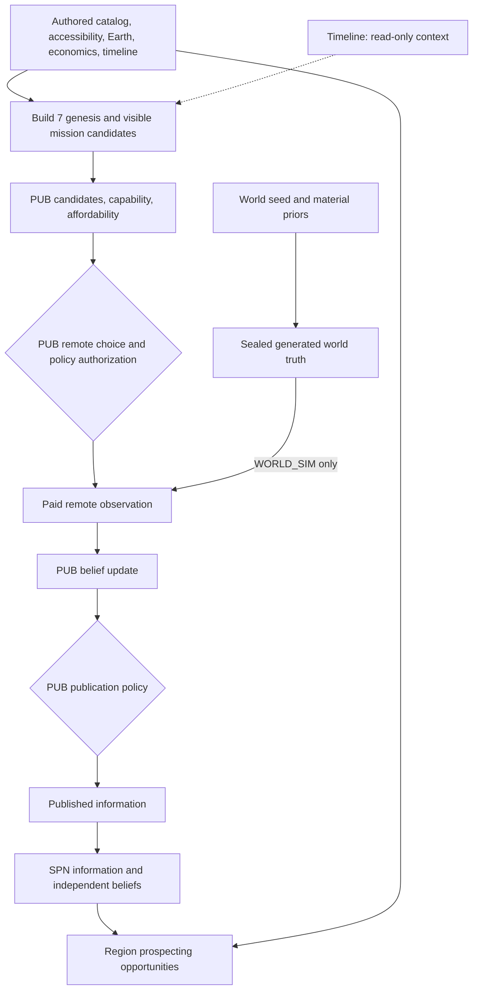
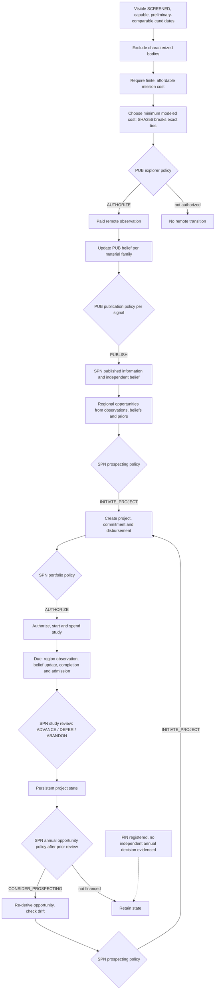
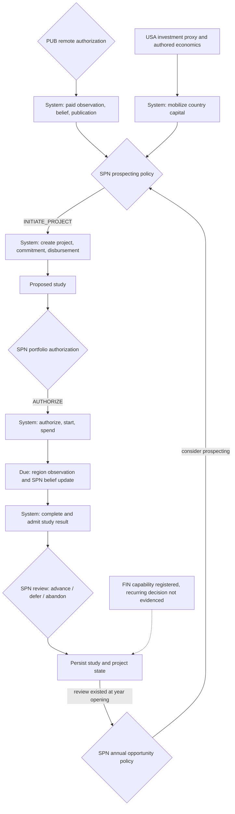
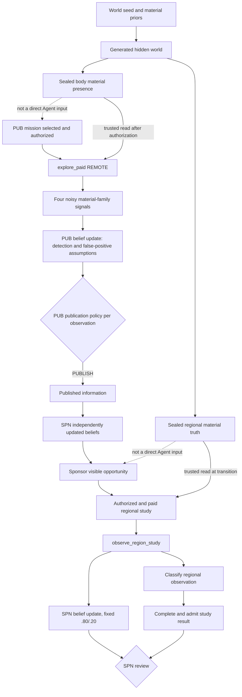
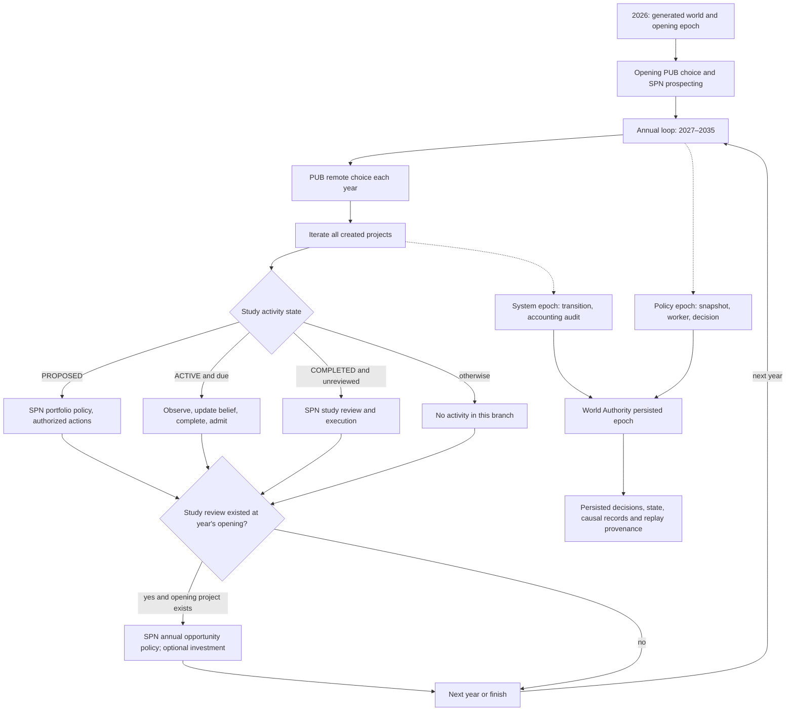
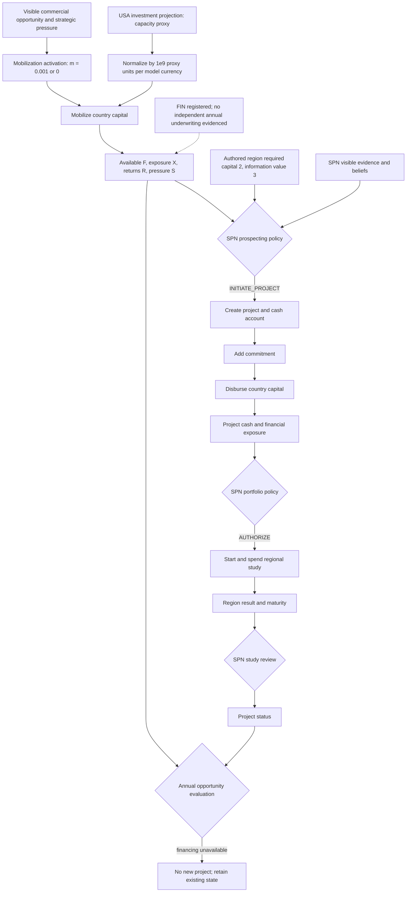
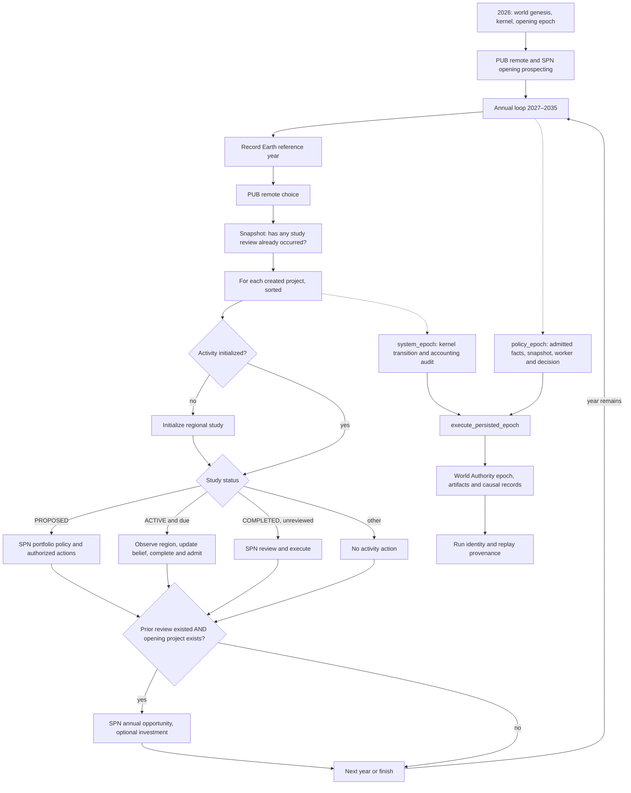
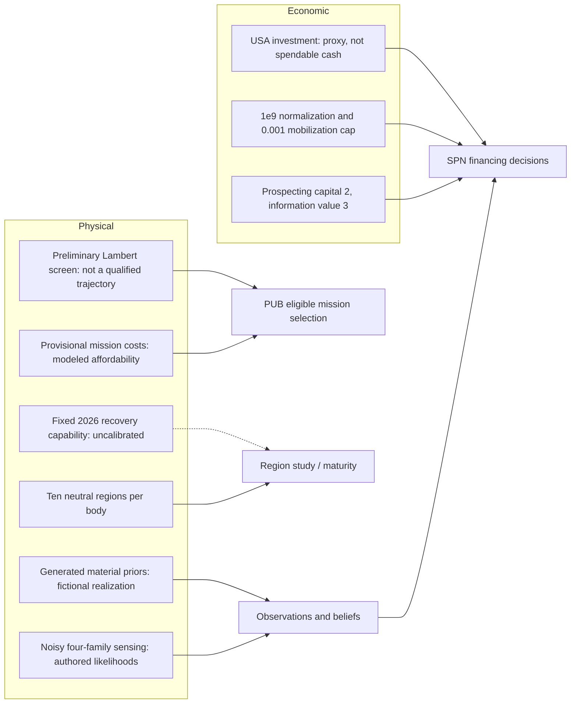

# Build 7 | Rendered as-built atlas

**Source authority:** pinned Build 7 commit `66c641d25e641e0aff77940a8cadbf1653247113`. Generated-world annual pathway, 2026–2035. Source register: [README](README.md). [Exact Agent policy gates](DECISIONS.md). Placeholder and abstraction register: [ABSTRACTIONS](ABSTRACTIONS.md). These diagrams render directly on GitHub in Markdown.

**Notation:** solid links describe source-supported relationships; dashed links are contextual, conditional, or registered capabilities and must not be treated as exercised decisions. A diagram edge may abbreviate a documented call chain.

## World Overview

## Data Provenance

## World And Knowledge

## Agent Decisions

## Agents And Consequences

## Observations And Epistemics

## Time And Persistence

## Economics And Projects

## Time And Persistence

## Abstraction Boundaries

