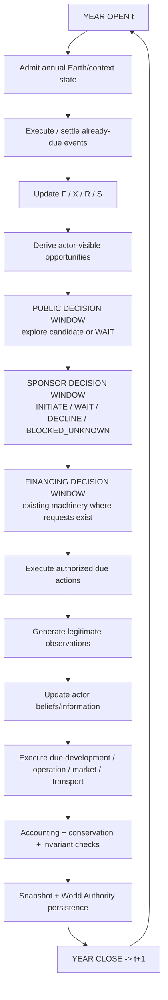

# LOOM Offworld Build 7 — Semantic Causal Model Map

**Status:** Build 7 acceptance-target model map  
**Scope:** Normal emergent 2026–2035 Offworld simulation  
**Model authority:** `../BUILD7_ACCEPTANCE_CRITERIA.md` beneath `../../OFFWORLD_MVP_GUIDING_FRD.md`  
**Implementation guidance:** `../BUILD7_EMERGENCE_IMPLEMENTATION_GUIDE.md`

This maps the simulated world and intended causal semantics, not the software stack. It describes the Build 7 state we intend to accept. Where current implementation has not reached that state, the registry says so.

Central causal claim:

`hidden WORLD + Earth state + actors + legitimate knowledge + capability + finite capital -> opportunities -> bounded decisions -> realized actions -> changed state -> later opportunities`

No celestial destination, development project, settlement, or successful history is imposed at GENESIS.

## Semantic legend

| Prefix | Meaning |
|---|---|
| `AGENT_*` | acting institutional entity |
| `STATE_*` | persistent modeled state |
| `ENV_*` | environmental or exogenous condition |
| `ACT_*` | bounded agent decision/action |
| `INT_*` | interaction or state-transition mechanism |
| `INST_*` | institutional rule/constraint |
| `FLOW_*` | conserved/accountable material, financial, or demographic flow |
| `EM_*` | emergent result of repeated lower-level behavior |
| `OBS_*` | observation or derived measurement |

Mermaid edge semantics: `-->` explicit causal/action relationship; `-.->` derived, observational, or emergent relationship; `==>` conserved/accountable transfer or stock flow.

`EM_*` nodes are outputs to explain, not targets to force. `UNKNOWN` is an epistemic state and never silently becomes feasibility, zero cost, or entitlement.

---

# Level 0 — World model

```mermaid
flowchart LR
  subgraph PHYS[Hidden physical world]
    ENV_WORLD["ENV_HIDDEN_WORLD<br/>Generated Solar physical truth"]
    STATE_RESOURCE["STATE_RESOURCE_PHYSICAL<br/>In-situ / accessible / recoverable / remaining"]
  end
  subgraph EARTH[Earth and exogenous context]
    ENV_EARTH["ENV_EARTH_REFERENCE<br/>Annual economic + demographic authority"]
    ENV_TECH["ENV_TECH_CAPABILITY<br/>Available technology/capability"]
    ENV_SOLAR["ENV_SOLAR_PUBLIC<br/>Known bodies + public evidence + relational accessibility"]
  end
  subgraph ACTORS[Institutional actors]
    AGENT_PUBLIC["AGENT_PUBLIC_EXPLORER<br/>Public/institutional explorer"]
    AGENT_SPONSOR["AGENT_SPONSOR<br/>Sponsor/operator"]
    AGENT_FINANCIER["AGENT_FINANCIER<br/>Financing institution"]
    STATE_KNOWLEDGE["STATE_ACTOR_KNOWLEDGE<br/>Visible facts, beliefs, posteriors"]
  end
  subgraph FRONT[Emergent causal front end]
    INT_OPPORTUNITY["INT_OPPORTUNITY_DERIVATION<br/>Transient visible candidate opportunities"]
    ACT_EXPLORE["ACT_EXPLORE_CHOICE<br/>Explore one / follow-on / WAIT"]
    INT_OBSERVE["INT_AUTHORIZED_OBSERVATION<br/>WORLD_SIM sensing"]
    INT_BELIEF["INT_BELIEF_UPDATE<br/>Observation -> actor knowledge"]
    STATE_CAPITAL["STATE_COUNTRY_CAPITAL<br/>F / X / R / S"]
    INT_MOBILIZE["INT_CAPITAL_MOBILIZATION<br/>M = I × m(O,S)"]
    ACT_PROJECT["ACT_PROJECT_INITIATION<br/>INITIATE / WAIT / DECLINE / BLOCKED_UNKNOWN"]
    INT_CREATE["INT_PROJECT_CREATION<br/>Authorized durable project creation"]
  end
  subgraph CONSEQ[Qualified consequence chain]
    STATE_PROJECT["STATE_PROJECT<br/>Durable project + lifecycle + account + location"]
    ACT_FINANCE["ACT_FINANCING_DECISION<br/>Commit / decline"]
    FLOW_CAPITAL["FLOW_OFFWORLD_CAPITAL<br/>Commitment -> disbursement -> return/loss"]
    INT_DEVELOP["INT_DEVELOPMENT<br/>Capex + productive capacity"]
    INT_RECOVERY["INT_RECOVERABILITY_ASSESSMENT<br/>Capability + physical state -> assessed recovery"]
    INT_OPERATE["INT_OPERATION_EXTRACTION<br/>Operate / extract or fail"]
    INT_MARKET["INT_MARKET_SALE<br/>Sale / revenue / surplus"]
    INT_SETTLEMENT["INT_SETTLEMENT_SUPPORT<br/>Infrastructure + settlement transitions"]
    FLOW_POP["FLOW_POPULATION_TRANSPORT<br/>Source-debited migration / transport"]
  end
  subgraph RESULTS[Emergent results and measurements]
    EM_GEOGRAPHY["EM_OFFWORLD_GEOGRAPHY<br/>Which bodies become important or remain untouched"]
    EM_NETWORK["EM_OFFWORLD_ECONOMY<br/>Projects, production, trade, settlement pattern"]
    EM_PATH["EM_PATH_DEPENDENCE<br/>History changes later opportunity and choice"]
    OBS_SHADOW["OBS_EARTH_SHADOW<br/>D, B, NetFlow"]
    OBS_HISTORY["OBS_CAUSAL_HISTORY<br/>Auditable decisions, events, outcomes"]
  end

  ENV_SOLAR -->|"visible destination/access context"| INT_OPPORTUNITY
  ENV_TECH -->|"constrains feasible action"| INT_OPPORTUNITY
  STATE_KNOWLEDGE -->|"visible beliefs"| INT_OPPORTUNITY
  STATE_CAPITAL -->|"constrains affordability"| INT_OPPORTUNITY
  INT_OPPORTUNITY -->|"mission alternatives"| AGENT_PUBLIC
  AGENT_PUBLIC -->|"chooses"| ACT_EXPLORE
  ACT_EXPLORE -->|"authorizes sensing"| INT_OBSERVE
  ENV_WORLD -->|"only via authorized observation/physical transition"| INT_OBSERVE
  INT_OBSERVE -->|"legitimate evidence"| INT_BELIEF
  INT_BELIEF -->|"updates"| STATE_KNOWLEDGE

  ENV_EARTH -->|"I, K, VA, output, population, labor"| INT_MOBILIZE
  INT_OPPORTUNITY -->|"commercial opportunity O"| INT_MOBILIZE
  STATE_CAPITAL -->|"strategic pressure S + prior F/R"| INT_MOBILIZE
  INT_MOBILIZE ==>|"bounded cash M"| STATE_CAPITAL

  INT_OPPORTUNITY -->|"development candidate"| AGENT_SPONSOR
  STATE_CAPITAL -->|"financing context"| AGENT_SPONSOR
  AGENT_SPONSOR -->|"decides"| ACT_PROJECT
  ACT_PROJECT -->|"INITIATE only"| INT_CREATE
  INT_CREATE -->|"materializes"| STATE_PROJECT
  STATE_PROJECT -->|"requests financing"| AGENT_FINANCIER
  AGENT_FINANCIER -->|"decides"| ACT_FINANCE
  ACT_FINANCE -->|"commit/disburse"| FLOW_CAPITAL
  STATE_CAPITAL ==>|"F down, X up on disbursement"| FLOW_CAPITAL
  FLOW_CAPITAL ==>|"funds project"| STATE_PROJECT
  FLOW_CAPITAL -->|"enables, never guarantees"| INT_DEVELOP
  INT_DEVELOP -->|"realized capability"| INT_RECOVERY
  ENV_WORLD -->|"physical constraint"| INT_RECOVERY
  INT_RECOVERY -->|"may permit"| INT_OPERATE
  STATE_RESOURCE ==>|"resource removed if extraction succeeds"| INT_OPERATE
  INT_OPERATE ==>|"inventory / production"| INT_MARKET
  INT_MARKET ==>|"cash return or loss"| FLOW_CAPITAL
  FLOW_CAPITAL ==>|"R / X / retained F update"| STATE_CAPITAL
  FLOW_CAPITAL -.->|"Earth-facing transfers"| OBS_SHADOW

  INT_MARKET -->|"surplus may support"| INT_SETTLEMENT
  STATE_PROJECT -->|"infrastructure context"| INT_SETTLEMENT
  INT_SETTLEMENT -->|"may permit"| FLOW_POP
  FLOW_POP ==>|"moves population; conserves total"| INT_SETTLEMENT

  STATE_KNOWLEDGE -.-> EM_PATH
  STATE_CAPITAL -.-> EM_PATH
  STATE_PROJECT -.-> EM_PATH
  INT_SETTLEMENT -.-> EM_PATH
  EM_PATH -.->|"feeds later candidate context"| INT_OPPORTUNITY

  ACT_EXPLORE -.-> EM_GEOGRAPHY
  STATE_PROJECT -.-> EM_GEOGRAPHY
  INT_OPERATE -.-> EM_NETWORK
  INT_MARKET -.-> EM_NETWORK
  INT_SETTLEMENT -.-> EM_NETWORK
  FLOW_POP -.-> EM_NETWORK
  EM_NETWORK -.-> EM_GEOGRAPHY

  ACT_EXPLORE -.-> OBS_HISTORY
  ACT_PROJECT -.-> OBS_HISTORY
  ACT_FINANCE -.-> OBS_HISTORY
  INT_OPERATE -.-> OBS_HISTORY
```

The hidden WORLD does not nominate an opportunity or destination. It enters actor history only through authorized observation or later physical transitions. Actor choices create history. Repeated realized history changes later state, so geography, economic pattern, and path dependence are emergent rather than authored outcomes.

`FUNDED != BUILDABLE != PRODUCTIVE != PROFITABLE` remains a causal invariant. A barren world, rejected project, failed development, untouched body, or no-action year is valid.

---

# Level 1A — Knowledge, exploration, and physical truth

```mermaid
flowchart LR
  ENV_PUBLIC["ENV_SOLAR_PUBLIC<br/>Known body/public evidence/accessibility"]
  STATE_K["STATE_ACTOR_KNOWLEDGE<br/>Beliefs + admitted facts"]
  INT_CAND["INT_OPPORTUNITY_DERIVATION<br/>Remote/follow-on candidates"]
  ACT_E["ACT_EXPLORE_CHOICE<br/>Mission or WAIT"]
  INST_GATE["INST_EXPLORATION_GATE<br/>Capability + budget + cost + VOI + prerequisites"]
  ENV_HIDDEN["ENV_HIDDEN_WORLD<br/>Hidden site/deposit truth"]
  INT_OBS["INT_AUTHORIZED_OBSERVATION<br/>Remote/surface observation"]
  OBS_EVIDENCE["OBS_RESOURCE_EVIDENCE<br/>Legitimate noisy observation"]
  INT_UPDATE["INT_BELIEF_UPDATE<br/>Posterior update"]
  EM_REDIRECT["EM_EXPLORATION_REDIRECTION<br/>Later attention shifts with learned state"]

  ENV_PUBLIC -->|"visible facts only"| INT_CAND
  STATE_K -->|"current belief state"| INT_CAND
  INT_CAND -->|"candidate set"| INST_GATE
  INST_GATE -->|"bounds choices"| ACT_E
  ACT_E -->|"selected mission only"| INT_OBS
  ENV_HIDDEN -->|"sensed only here"| INT_OBS
  INT_OBS -->|"produces"| OBS_EVIDENCE
  OBS_EVIDENCE -->|"updates"| INT_UPDATE
  INT_UPDATE -->|"changes"| STATE_K
  STATE_K -.->|"alters later candidate value/qualification"| EM_REDIRECT
  EM_REDIRECT -.-> INT_CAND
```

Hostile firewall: holding actor-visible state and keyed decision randomness fixed, changing hidden truth alone cannot change pre-observation behavior. Hidden truth may change a legitimate observation, after which history may diverge.

---

# Level 1B — Capital and project formation

```mermaid
flowchart LR
  ENV_E["ENV_EARTH_REFERENCE<br/>I, K, VA, output, population, labor"]
  STATE_F["STATE_COUNTRY_CAPITAL<br/>F cash / X exposure / R returns / S pressure"]
  INT_Q["INT_OPPORTUNITY_DERIVATION<br/>Actor-visible commercial candidates"]
  OBS_O["OBS_COMMERCIAL_OPPORTUNITY<br/>O from bounded eligible candidates"]
  INT_M["INT_CAPITAL_MOBILIZATION<br/>M = I × m(O,S), bounded by m_max"]
  AG_SP["AGENT_SPONSOR<br/>Sponsor/operator"]
  ACT_P["ACT_PROJECT_INITIATION<br/>INITIATE / WAIT / DECLINE / BLOCKED_UNKNOWN"]
  INT_PC["INT_PROJECT_CREATION<br/>Governed transition"]
  STATE_P["STATE_PROJECT<br/>Durable project"]
  AG_F["AGENT_FINANCIER<br/>Financier"]
  ACT_F["ACT_FINANCING_DECISION<br/>Commit / decline"]
  FLOW_D["FLOW_CAPITAL_DISBURSEMENT<br/>Earth-origin cash -> project"]
  INT_DEV["INT_DEVELOPMENT<br/>Capex / construction"]
  INT_OP["INT_OPERATION_EXTRACTION<br/>Production or failure"]
  INT_SALE["INT_MARKET_SALE<br/>Sale / revenue / surplus"]
  FLOW_R["FLOW_CAPITAL_RETURN<br/>Recovered basis / return / writeoff"]
  OBS_SH["OBS_EARTH_SHADOW<br/>D, B, NetFlow"]
  EM_ALLOC["EM_CAPITAL_ALLOCATION<br/>Where finite Offworld capital accumulates"]

  ENV_E -->|"investment capacity I"| INT_M
  INT_Q -.->|"derived commercial signal"| OBS_O
  OBS_O -->|"O"| INT_M
  STATE_F -->|"S + prior cash/returns"| INT_M
  INT_M ==>|"mobilized cash M"| STATE_F
  INT_Q -->|"development candidates"| AG_SP
  STATE_F -->|"financing context"| AG_SP
  AG_SP -->|"decides"| ACT_P
  ACT_P -->|"INITIATE only"| INT_PC
  INT_PC --> STATE_P
  STATE_P -->|"requests"| AG_F
  AG_F --> ACT_F
  ACT_F -->|"commitment may reserve cash"| STATE_F
  ACT_F -->|"actual disbursement"| FLOW_D
  STATE_F ==>|"F down, X up"| FLOW_D
  FLOW_D ==> STATE_P
  FLOW_D --> INT_DEV
  INT_DEV --> INT_OP
  INT_OP ==> INT_SALE
  INT_SALE ==> FLOW_R
  FLOW_R ==>|"R/F/X update or writeoff"| STATE_F
  FLOW_D -.-> OBS_SH
  FLOW_R -.-> OBS_SH
  FLOW_D -.-> EM_ALLOC
  FLOW_R -.-> EM_ALLOC
  STATE_P -.-> EM_ALLOC
  EM_ALLOC -.->|"changes later opportunity/finance"| INT_Q
```

Earth reference is immutable context. Earth investment does not become financier cash directly. Mobilization is the explicit bridge. Commitment is not Earth diversion; actual disbursement is. Commercial opportunity and strategic pressure remain distinct causes. Build 7 does not model banks, securities markets, government balance sheets, household finance, or endogenous commodity-price formation.

---

# Level 1C — Consequences, settlement, and path dependence

```mermaid
flowchart LR
  STATE_P["STATE_PROJECT<br/>Financed durable venture"]
  INT_DEV["INT_DEVELOPMENT<br/>Build productive capacity"]
  STATE_R["STATE_RESOURCE_PHYSICAL<br/>In-situ/access/recoverability/remaining"]
  INT_REC["INT_RECOVERABILITY_ASSESSMENT<br/>Realized capability assessment"]
  INT_OP["INT_OPERATION_EXTRACTION<br/>Operate / fail / extract"]
  INT_MKT["INT_MARKET_SALE<br/>Existing sale mechanism"]
  STATE_INFRA["STATE_LOCAL_INFRASTRUCTURE<br/>Productive/support capacity"]
  INT_SETTLE["INT_SETTLEMENT_SUPPORT<br/>Infrastructure + settlement transition"]
  FLOW_MIG["FLOW_POPULATION_TRANSPORT<br/>Earth/transit/Offworld population"]
  STATE_LOCAL["STATE_LOCAL_CIVILIZATION<br/>Population + infrastructure + projects + demand"]
  EM_PATH["EM_PATH_DEPENDENCE<br/>History changes future choices"]
  EM_GEO["EM_OFFWORLD_GEOGRAPHY<br/>Active, sparse, failed, or untouched places"]

  STATE_P --> INT_DEV
  INT_DEV -->|"creates capability/capacity"| STATE_INFRA
  STATE_INFRA --> INT_REC
  STATE_R -->|"physical bound"| INT_REC
  INT_REC -->|"may permit"| INT_OP
  STATE_R ==>|"conserved extraction"| INT_OP
  INT_OP ==> INT_MKT
  INT_MKT -->|"surplus may support"| INT_SETTLE
  STATE_INFRA -->|"support/headroom"| INT_SETTLE
  INT_SETTLE -->|"may authorize"| FLOW_MIG
  FLOW_MIG ==> STATE_LOCAL
  STATE_INFRA --> STATE_LOCAL
  STATE_P --> STATE_LOCAL
  STATE_LOCAL -.-> EM_PATH
  EM_PATH -.->|"future opportunity/access/demand context"| STATE_P
  STATE_LOCAL -.-> EM_GEO
  INT_OP -.-> EM_GEO
  FLOW_MIG -.-> EM_GEO
```

Settlement is not a required terminal state. The 2026–2035 emergent qualification reaches operation where its bounded fixture legitimately permits it. Deeper progression is conditional; inherited targeted regressions retain deep-chain proof.

---

# Execution / scheduling view

The annual loop is the inspectable macro-period. Existing subannual scheduler semantics remain where missions, financing, construction, transport, or operations require them. Information learned after a current decision window affects the next legitimate decision window, not an earlier decision retroactively.

---

# Compact semantic registry

| ID | Type | Meaning | Implementation / status |
|---|---|---|---|
| `ENV_HIDDEN_WORLD` | Environment | Generated 90-body physical truth, invisible to ordinary actor decisions | Existing: `build7/generated_campaign.py`; inherited generated-world machinery |
| `ENV_EARTH_REFERENCE` | Environment | Promoted annual Earth demographic/economic reference | Existing consumption in `build7/generated_campaign.py`; `record_earth_reference_year()` |
| `ENV_SOLAR_PUBLIC` | Environment | Public body identity/evidence/accessibility | Increment 2: `build7/opportunities.py` and pinned Build 7 inputs |
| `ENV_TECH_CAPABILITY` | Environment | Available technology/capability | Existing capability state; opportunity gating now present |
| `AGENT_PUBLIC_EXPLORER` | Agent | Decides whether/where to explore | Existing actor/policy primitives; endogenous multi-candidate choice acceptance-target |
| `AGENT_SPONSOR` | Agent | Decides whether to initiate durable project | Existing actor/decision protocol; emergent integration acceptance-target |
| `AGENT_FINANCIER` | Agent | Evaluates financing requests | Existing financing protocol/kernel |
| `STATE_ACTOR_KNOWLEDGE` | State | Visible facts, beliefs, posteriors | Existing observation/belief machinery plus Build 7 public opportunity surface |
| `STATE_COUNTRY_CAPITAL` | State | Country-indexed F/X/R/S | Zero-state initialized; full semantics acceptance-target |
| `STATE_PROJECT` | State | Durable selected project | Existing downstream state; endogenous creation acceptance-target |
| `STATE_RESOURCE_PHYSICAL` | State | Physical resource/conservation state | Existing generated-world and kernel resource state |
| `INT_OPPORTUNITY_DERIVATION` | Interaction | Pure/reconstructable visible candidate generation | Increment 2: `build7/opportunities.py`; commercial candidates later |
| `ACT_EXPLORE_CHOICE` | Action | Choose legitimate mission or no mission | Acceptance-target Increment 3 |
| `INT_AUTHORIZED_OBSERVATION` | Interaction | Only authorized WORLD_SIM sensing reveals hidden truth | Existing `MVPKernel.observe()` and prospecting machinery |
| `INT_BELIEF_UPDATE` | Interaction | Observation changes belief | Existing `update_agent_belief_from_observation()` |
| `INT_CAPITAL_MOBILIZATION` | Interaction | Bounded Earth capacity -> Offworld cash via O and S | Acceptance-target |
| `OBS_COMMERCIAL_OPPORTUNITY` | Observation | Bounded country signal O from visible prospective economics | Acceptance-target |
| `ACT_PROJECT_INITIATION` | Action | INITIATE / WAIT / DECLINE / BLOCKED_UNKNOWN | Protocol partly exists; emergent integration acceptance-target |
| `INT_PROJECT_CREATION` | Interaction | Authorized transition materializes one project | Acceptance-target; reuse existing project semantics |
| `ACT_FINANCING_DECISION` | Action | Financier decides on real request | Existing financing machinery |
| `FLOW_OFFWORLD_CAPITAL` | Flow | Commitment, disbursement, exposure, return/loss | Existing transfers plus acceptance-target F/X/R bridge |
| `INT_DEVELOPMENT` | Interaction | Capex creates productive capacity | Existing downstream machinery |
| `INT_RECOVERABILITY_ASSESSMENT` | Interaction | Capability + physical state establishes recovery knowledge | Existing assessment/physical checks |
| `INT_OPERATION_EXTRACTION` | Interaction | Operating decision and extraction/failure | Existing methodology/kernel |
| `INT_MARKET_SALE` | Interaction | Bounded sale converts inventory to revenue | Existing `sell()` / `market.py`; not endogenous price formation |
| `INT_SETTLEMENT_SUPPORT` | Interaction | Support/infrastructure may enable settlement | Existing settlement machinery |
| `FLOW_POPULATION_TRANSPORT` | Flow | Source-debited population movement | Existing migration/transport machinery |
| `OBS_EARTH_SHADOW` | Observation | D, B, NetFlow without rewriting Earth reference | Existing Earth shadow; new capital reconciliation acceptance-target |
| `OBS_CAUSAL_HISTORY` | Observation | Auditable causal decisions/events/outcomes | Existing causal/scheduler/persistence machinery |
| `EM_PATH_DEPENDENCE` | Emergent | Realized history alters later opportunity/choice | Acceptance-target integration, not a separate engine |
| `EM_CAPITAL_ALLOCATION` | Emergent | Finite capital accumulates/withdraws across ventures | Emerges from mobilization, decisions, returns/losses |
| `EM_OFFWORLD_ECONOMY` | Emergent | Pattern of ventures, production, exchange, settlement | Lower-level result; no economy setter |
| `EM_OFFWORLD_GEOGRAPHY` | Emergent | Bodies become active, important, failed, or untouched | Core Build 7 emergent result; never authored importance |
| `INST_EPISTEMIC_FIREWALL` | Institution | Hidden truth cannot affect pre-observation decisions | Existing/extended invariant; hostile twin required |
| `INST_WORLD_AUTHORITY` | Institution | Governed persistence/reopen/replay | Existing; no replacement permitted |
| `INST_CONSERVATION` | Institution | Financial/resource/population conservation | Existing invariants plus capital reconciliation |
| `INST_TIMELINE` | Institution | Timeline constrains availability but dates do not cause action | Existing read-only authority |

---

# Unresolved / intentionally bounded relationships

1. **Capital mobilization coefficients.** `m(O,S)` is fixed conceptually; accepted numerical parameters must be explicit/versioned and are not inferred here.
2. **Commercial opportunity aggregation.** `O` must distinguish attractive, weak, and absent opportunity without rewarding candidate count. Acceptance allows bounded top opportunity or small top-k; final rule remains to be qualified.
3. **Strategic pressure.** `S = BaseSalience + RacePressure` has an accepted seam, but Build 7 requires only a bounded actor-visible fixture, not geopolitics.
4. **Exploration utility/VOI.** Selection must use visible knowledge, accessibility, capability, finite budget, mission cost and VOI. Exact bounded choice belongs to Increment 3 and cannot read hidden truth.
5. **Project creation transition.** Semantics are fixed; governed sponsor-decision -> durable-project materialization remains acceptance-target work.
6. **Annual conductor.** Required ordering is defined above; integration through 2026–2035 remains acceptance-target work.
7. **Path-dependence strength.** Channels are specified, but no geography or settlement count is prescribed. Qualification needs at least one traceable later change from prior realized state.
8. **Commodity prices.** Existing bounded sale/market mechanism is preserved. Endogenous commodity-price formation is explicitly outside Build 7, so no `EM_COMMODITY_PRICE` is asserted.
9. **Earth macro feedback.** D and B are measured, but feeding them back into promoted Earth propagation is not required.
10. **Deep settlement by 2035.** Not required. Integrated qualification must reach operation where legitimate; deeper progression is conditional and targeted regressions preserve deep-chain proof.

---

# Acceptance reading rule for coding agents

Trace any affected semantic node backward and forward:

`EM_* -> interactions -> actor actions/decisions -> actor/world state -> environmental/institutional constraints`

If a proposed change directly sets an `EM_*` result, privileges a destination, exposes hidden WORLD state to a decision, turns an opportunity into a project without sponsor authorization, converts Earth reference investment directly into spendable project cash, or creates settlement because a calendar year arrived, it conflicts with this map unless a higher authority explicitly changes the model.

Where this map and current code differ, surface the difference. Do not silently redefine the model to match the code.
